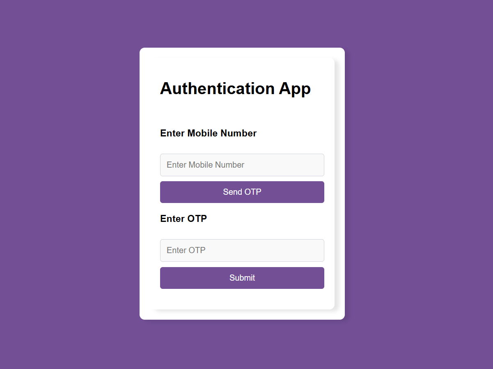

<h2>Task1:</h2>

The task involves developing a React.js application that uses Firebase to implement mobile number authentication, allowing users to verify their identity through OTP. Please find the below link

<a href="https://mern-projects-kglb.vercel.app/">deployment link of mob-auth-app</a>

